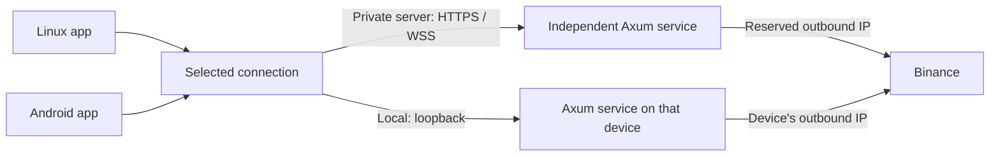

# ADR 0015: Select between local and private-server backends

- Status: Initial deployment implemented; further decoupling planned
- Date: 2026-09-15
- Confirmed product scope: One private server for the owner's Linux and Android
  clients, with local mode retained.

## Initial deployment status

The private backend is deployed at `https://terminal.fyxtez.com` and the installed
Linux app 1.0.36 uses it. HTTPS account, candle and WebSocket requests were verified,
including requests from the installed WebView; no local backend process runs in
this mode. Existing Binance credentials and the local journal/settings were
migrated with explicit authorization. The shared native adapter is available to
Android, but a packaged Android/device test remains pending.

The initial implementation uses one owner access token, server identity pinning,
server-managed Binance credentials, scoped remote workspaces and persistent
remote intent IDs. Remote market data shares a server cache and Binance requests
share rate-limit backoff. Per-device pairing, full backend snapshot deduplication
and further host abstraction below remain planned work. Local market data keeps
its existing direct path. See [deployment and recovery instructions](../../deploy/README.md)
for the implemented boundaries and operational details.

The installed app also opens the private server UI in the default browser.
The owner token administers server browser access and issues a one-use launch
ticket; the browser receives a Secure HttpOnly cookie and a separate proof,
with exact-origin checks and persistent revocation. It connects independently
of the desktop app. This server browser authority is separate from local
desktop lifecycle and credential controls, which remain denied remotely.

## Context

The owner's A1 5G connection has a changing public IP address. Binance can reject
authenticated requests when that address is outside the API key's IP allowlist.
Separately, the observed Binance HTTP 429 response showed that requests from the
current public IP exceeded its request-weight allowance. Moving the exchange
connection to a server with a reserved outbound public IP addresses the first
problem; sharing exchange requests between clients addresses the second.

Binance documents that request-weight limits apply per IP, and that clients must
back off after HTTP 429. A different host alone does not eliminate rate limits.
See [Binance USD-M Futures general information](https://developers.binance.com/en/docs/products/derivatives-trading-usds-futures/general-info).

The existing React/Axum boundary provides a useful starting point, but several
parts still assume that the backend runs on the device:

| Area | Current coupling | Required boundary |
| --- | --- | --- |
| Backend host | `backend/src/main.rs` already runs the shared service independently, but `backend/src/lib.rs` constructs Binance from the platform credential store | Host supplies configuration, credentials, persistence and shutdown to the shared service |
| Native startup | Tauri starts `BackendSupervisor` at setup; desktop spawns a sidecar and Android embeds the Rust service | Start a local service only for a selected local connection |
| Frontend connection | `frontend/src/config/constants.ts` obtains a loopback URL and token through `desktop_runtime` | Resolve an explicit connection profile through a common client interface |
| Account setup | `frontend/src/desktop/credentials.ts` uses the device's credential status to enable trading | Obtain account readiness and network from the selected backend |
| Market data | `binanceMarketData.ts` and `exchangeInfo.ts` call Binance directly from the frontend | Obtain Binance prices, history and symbol filters through the selected backend |
| Snapshot reads | Frontend caches deduplicate within a window; backend account and open-order routes still make exchange requests on reads | Share snapshot refreshes and exchange backoff on the backend |
| Authorization | The service bearer token currently identifies a native client with local control permissions | Give remote devices their own revocable authorization and route permissions |
| Pending work | Drawing queues are keyed by symbol; financial retry maps use endpoint and payload | Scope queued work and cached results to a backend, account and network |

ADRs 0004, 0005 and 0010 describe the existing desktop and mobile local hosts.
ADR 0014 describes the Linux local browser companion. This proposal adds a new
host and connection mode; those accepted decisions continue to govern their
existing modes until an implementation is accepted.

## Decision

### One application, two explicit connection modes

Keep the shared React interface and Rust trading service in the same repository.
Linux and Android use the same trading API and connection state model. Their
platform code supplies secure storage and, when selected, a local service host.

The diagram shows alternatives for each app. Each app has exactly one active
connection; selecting a profile does not broadcast requests to both services.

Settings exposes **Local** and **Private server**. A private-server profile holds
a server URL and a reference to a device credential in native secure storage.
First setup pairs the device with the private server. Existing installations
start in local mode until the user selects a server profile.

Live/Practice is a separate account setting, reported by the selected backend.
The UI shows connection mode, network and connection health so the destination
of a trading action is clear. Retry reconnects to the selected profile.

There is no automatic switch to local trading when a remote connection fails.
Switching profiles explicitly stops subscriptions, invalidates cached responses
and detaches pending work from the active view. Unresolved financial intents
remain associated with their original backend and can only be reconciled there.

### Separate the service from its host

The shared backend owns Binance requests, account/order reconciliation, trading
locks, durable financial intents and shared chart documents. It accepts host
configuration rather than discovering a desktop environment itself.

- The Linux local host supplies OS credentials, a private data directory, a
  loopback listener and the sidecar's parent-controlled lifecycle.
- The Android local host supplies platform credentials, app-private persistence
  and the embedded service lifecycle.
- The server host supplies server-managed credentials, durable storage and an
  independent service lifecycle. It must start without an interactive desktop
  keyring or a running client application.

The existing `SecretReader` abstraction is a starting point for credential
injection. Server deployment must define an owner-controlled secret-file or
service-credential provider, permissions and rotation procedure. It must not
require placing Binance secrets in the React bundle, application profiles or
process command-line arguments.

The server has one owner and one configured Binance connection in this version.
Linux and Android authorize as separate devices of that owner. Both observe the
same server journal and account projections; existing trading locks and durable
intent protection remain part of every financial mutation.

### Define a remote client contract

An authenticated connection handshake returns an API compatibility version, a
stable backend identity, an opaque account scope, network, configured state and
supported client capabilities. It never returns Binance credentials. Client and
server releases can then evolve independently, with an explicit compatibility
error before trading if their contracts do not match.

Remote device credentials are independently revocable. Their authentication
principal must be distinct from the existing native sidecar token: pairing a
device must not implicitly authorize desktop lifecycle or local browser-access
administration. Apply equivalent checks to HTTP requests and event streams.

Use HTTPS and WSS for remote connections, with authenticated API access and
explicit origin rules. Keep the UI bundled in the installed application and
review Tauri's CSP and network permissions for the selected server connection.
Server access does not require granting native commands to server-hosted HTML.
See [Tauri capabilities](https://v2.tauri.app/security/capabilities/).

### Share exchange work at the backend

Move the installed clients' Binance candles, history and exchange metadata onto
backend market-data routes. Share upstream subscriptions or polling by market
and interval, and share history/cache fills across clients. Carry freshness and
reconnect state to the UI; retain bounded REST recovery where needed.

Deduplicate passive account and open-order snapshot refreshes in the backend,
including concurrent requests from different devices. Exchange backoff and
request-weight accounting must cover its public and signed Binance traffic.
Opening the same chart on two devices must reuse the same upstream work.

Passive display caches must not replace authoritative pre-trade validation or
post-trade reconciliation. Account cache keys include account and network;
market cache keys include the exchange market and requested range/interval.

### Preserve identity through disconnects and profile changes

Key client caches, chart synchronization queues and financial intents by stable
backend identity, account scope and network. A URL alone is insufficient because
a server can move or a different server can replace it at the same address.

Retain an intent ID durably before dispatching a financial mutation. If the
connection drops after dispatch, mark the result as unknown and query the same
backend's durable intent state on reconnect. Do not issue a new intent merely
because the original HTTP response was lost. Binance explicitly documents
unknown execution outcomes that require reconciliation before retrying; see
[Binance request failure handling](https://developers.binance.com/en/docs/products/derivatives-trading-usds-futures/general-info).

Keep layouts and ordinary display preferences on each device. Shared manual
drawings belong to the selected backend/account scope. Existing unscoped local
queues need an explicit migration to the existing local profile, not an automatic
upload to a newly selected server.

## Consequences

- A reserved server egress IP can be allowlisted for the server's Binance API
  key while the phone and home internet addresses change. Deployment must verify
  the actual outbound address and that it remains assigned across restarts.
- A 5G interruption still disconnects the affected client. The remote service
  continues independently; reconnect restores authoritative state rather than
  promising uninterrupted prices on an offline device.
- Local trading still requires Binance permissions for the device's outbound
  IP. A key restricted to the server IP does not automatically work in local
  mode. Use explicit credentials and permissions for each deployment.
- The two devices share state when connected to the same private server. Their
  local services retain separate journals. If both deployments access the same
  Binance account, their locks are independent; the initial deployment should
  use one active trading backend for that account at a time.
- Server persistence and device authorization become operational responsibilities,
  including journal backups, credential rotation, service restart and compatible
  upgrades. Restoring a backup requires exchange reconciliation before trading.
- The application can retain the sidecar and embedded library for local use
  without starting either in remote mode. Splitting repositories or removing the
  local backend from the Android package is not required for this boundary.

## Follow-up

Implement and review in this order:

1. **Extract host and connection interfaces.** Introduce the profile/session
   contract and inject backend credentials/configuration. Exercise the existing
   Linux sidecar, Android embedded host and browser companion through the local
   adapters before enabling remote profiles.
2. **Add a standalone server and remote sessions.** Implement server credential
   loading, persistent device authorization, handshake/version checks and
   authenticated event streams. Add server settings to both native clients and
   make local service startup conditional on the selected profile. Scope client
   state and durable pending intents before enabling remote trading.
3. **Centralize Binance reads.** Move installed-client Binance market data to the
   backend, share snapshot refreshes and apply one upstream rate policy. Verify
   HTTP request counts with two simultaneous clients and preserve fresh checks
   on the order path.
4. **Package and deploy.** Prepare service configuration, HTTPS ingress, persistent
   data and backup/restore instructions. Verify a reserved outbound IP and Binance
   connectivity on the chosen host before provisioning account credentials and
   pairing devices. Server access details are still needed for this stage.

Completion checks:

- Linux and Android can select the private server, restart and reconnect without
  starting a local backend; local startup and shutdown still work on both.
- Both remote clients see the same orders and journal. A second client viewing
  the same data does not double upstream Binance reads.
- Dropping a connection immediately after submitting an order and restarting
  either client resolves the original intent without placing a duplicate order.
- Switching profiles while reads, drawing edits or financial requests are in
  flight cannot transfer results or pending work to the new profile.
- Revoked device credentials fail for HTTP and streaming access. Remote clients
  cannot call native-only control routes. Incompatible versions fail clearly.
- A server restart preserves authorization and the journal, reconnects exchange
  state and needs no desktop session. Client-visible diagnostics contain no keys
  or credentials.
- Packaged Linux and Android builds pass connection/lifecycle regressions, and
  financial behavior is exercised against a controlled test exchange or Testnet
  before enabling the remote Mainnet connection.
